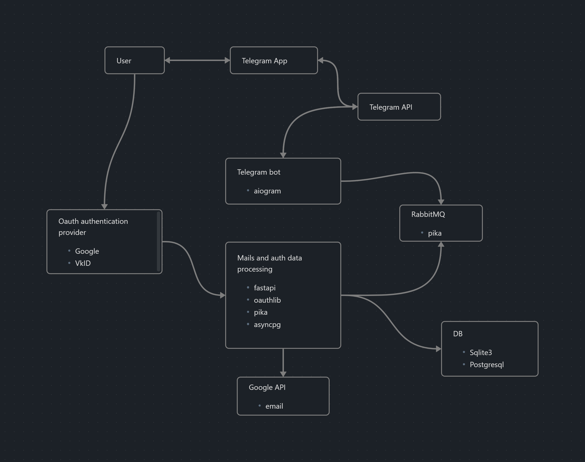

Проект по курсу "Язык программирования Python (углубленный курс)". Авторы: Сергиенко Елизавета и Дубровин Александр, студенты 3 курса ОП "Экономика и статистика" НИУ ВШЭ

## Схема проекта

## Описание

В самом начале наш  User заходит в  Telegram App. Наш Telegram bot взаимодействует с  Telegram App через Telegram API. Telegram Bot API — это HTTP-интерфейс, который позволяет разработчикам взаимодействовать с Telegram-ботами. Боты могут отправлять и получать сообщения, а также выполнять различные команды и получать данные от пользователей. 
  
Для взаимодействия с API Telegram мы будем использовать aiogram. С помощью aiogram можно отправлять и получать сообщения, управлять чатами, обрабатывать команды пользователей и многое другое. Также посредством команд бот сможет фильтровать сообщения на основе заданных ключевых слов и предоставлять пользователю ответы или уведомления,  что будет необходимо нам для парсинга важных сообщений в почте.

 Разобьем итоговую программу на 2 части: Telegram Bot и часть(‘Mails and auth data processing’), которая будет отвечать за парсинг почты, работу с провайдером аутентификации (Google, VkID) и работу с БД. В блоке ‘Mails and auth data processing’ мы будем использовать следующие библиотеки:

- fastapi
	Асинхронный веб-фреймворк, который мы будем использовать для получения токенов авторизации от Google.
- oauthlib
    Библиотека для работы с протоколом oauth2(нужно для получения авторизационных токенов). В свою очередь токены нам понадобятся для взаимодействия с GoogleAPI,  получения почты и информации о пользователе.
- pika
    Библиотека для взаимодействия с RabbitMQ
- asyncpg
    Асинхронная библиотека для работы с Postgresql. 
- sqlite3
    Библиотека для работы с встраиваемой БД sqlite

Взаимодействие между Telegram Bot и ‘Mails and auth data processing’ будет происходить с помощью RabbitMQ. RabbitMQ — это популярный брокер сообщений, который используется для обработки и маршрутизации сообщений между различными компонентами распределенных приложений. А с RabbitMq мы будем работать через питоновскую библиотеку pika.
